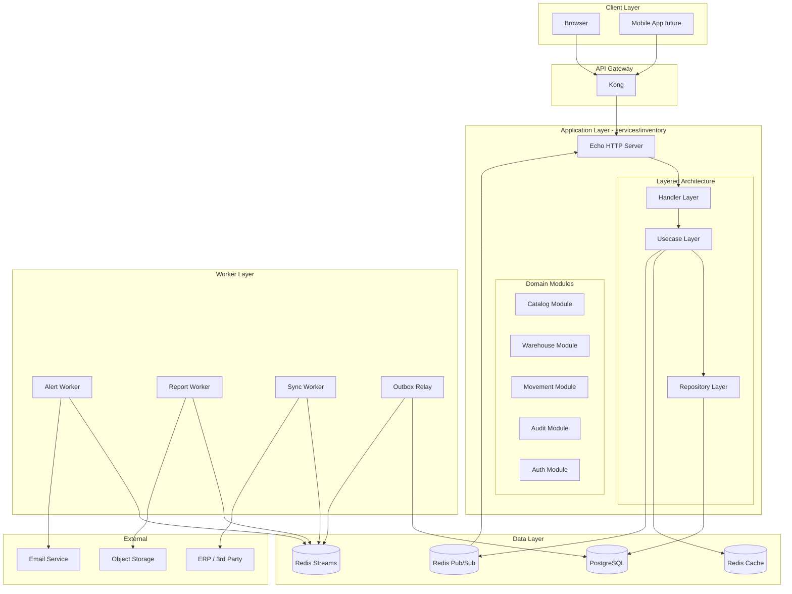
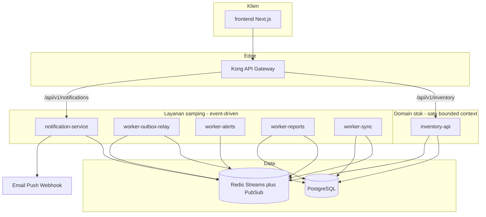
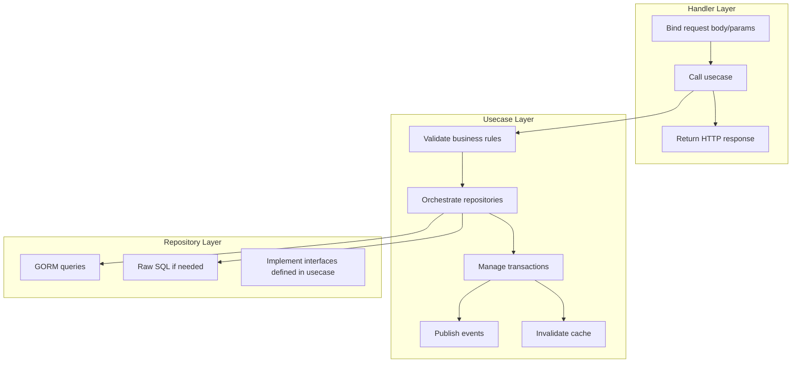
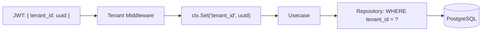
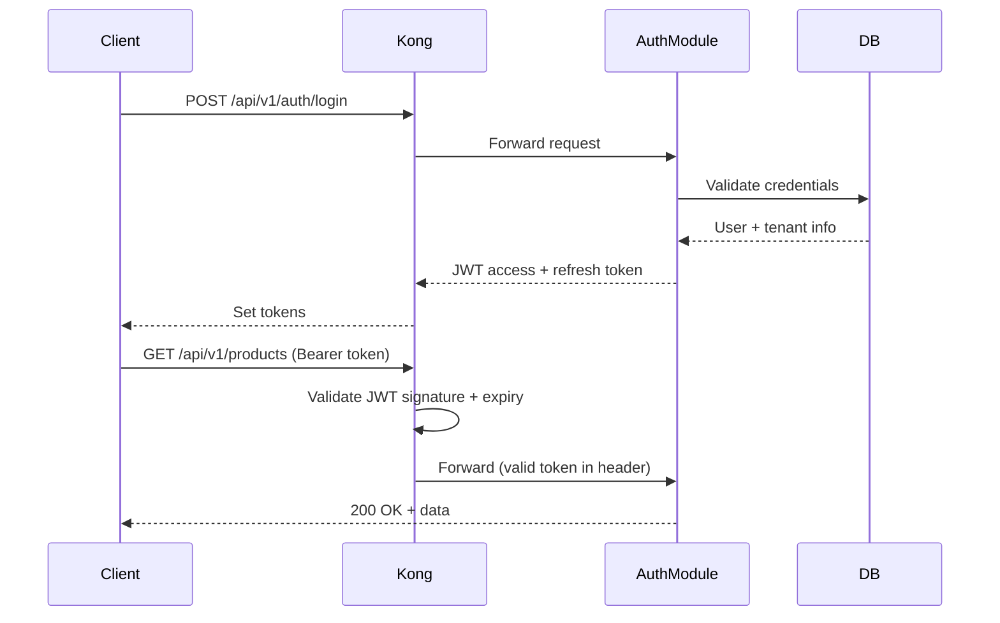
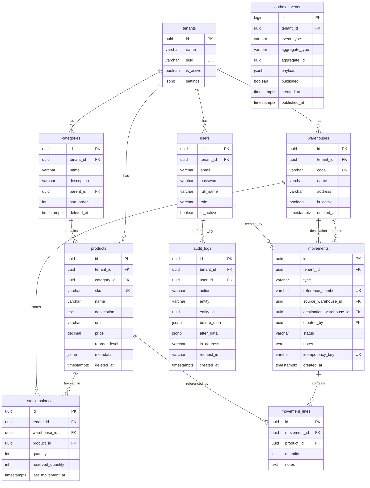
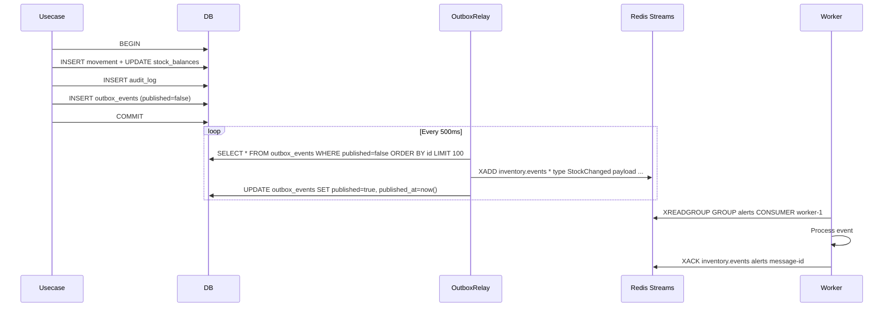
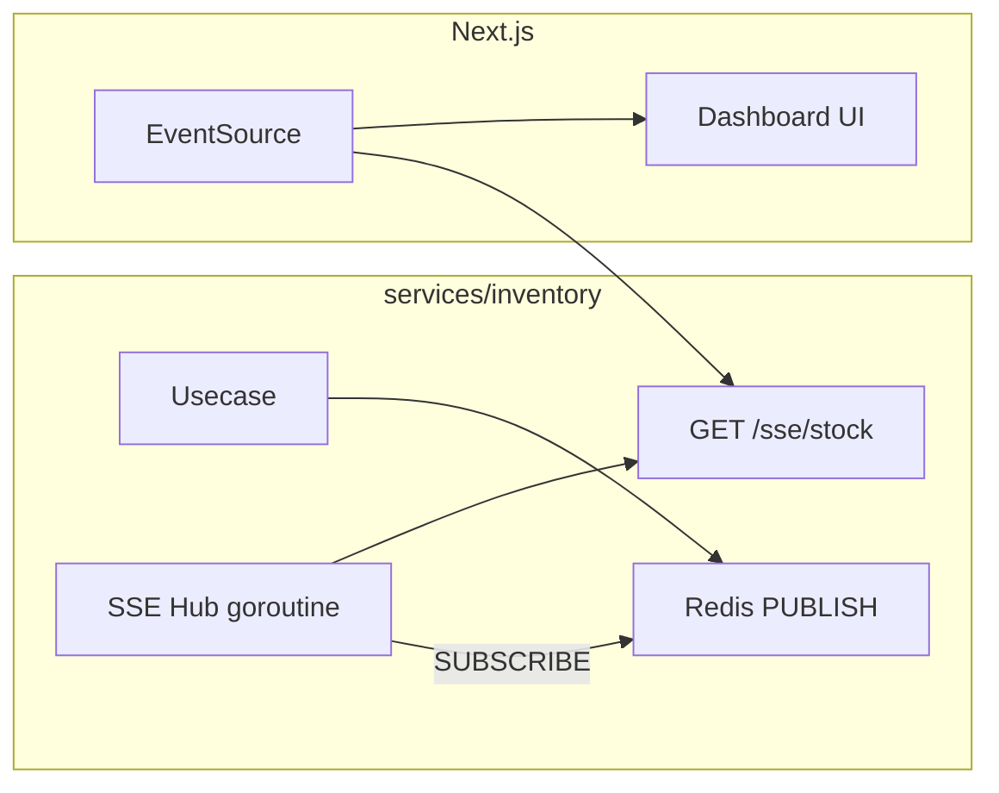
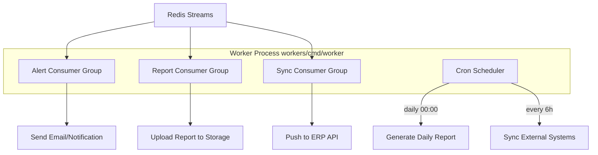
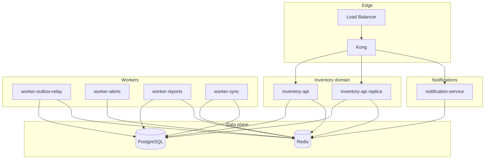

# Inventory Management System — Architecture Document

> **Version:** 1.0.0
> **Last Updated:** 2026-04-18
> **Status:** Draft
> **Bahasa:** Dokumen ini dalam Bahasa Indonesia — versi Inggris: [ARCHITECTURE.en.md](ARCHITECTURE.en.md)

**Konvensi repositori (wajib untuk developer backend):** ikuti [`CLAUDE.md`](CLAUDE.md) — entry point yang mengarahkan ke [`docs/conventions/codebase-conventions.md`](docs/conventions/codebase-conventions.md); indeks panduan per-topik ada di [`docs/README.md`](docs/README.md). Alur verifikasi dan quality gates dirangkum di [§17.1](#171-quality-gates-dan-alur-pengembangan). Panduan workflow agent ada di [`.claude/CLAUDE.md`](.claude/CLAUDE.md) (opsional).

---

## Table of Contents

1. [Overview](#1-overview)
2. [Tech Stack](#2-tech-stack)
3. [High-Level Architecture](#3-high-level-architecture)
4. [Project Structure](#4-project-structure) — [§4.1 Pemetaan docs ↔ repo](#41-pemetaan-pola-dokumentasi--repo-ini)
5. [Layered Architecture](#5-layered-architecture)
6. [Multi-Tenancy Strategy](#6-multi-tenancy-strategy)
7. [Authentication & Authorization](#7-authentication--authorization)
8. [Database Design](#8-database-design)
9. [API Design](#9-api-design)
10. [Event-Driven Architecture](#10-event-driven-architecture)
11. [Realtime Dashboard](#11-realtime-dashboard)
12. [Job Queue & Automation](#12-job-queue--automation)
13. [Caching Strategy](#13-caching-strategy)
14. [Logging & Audit Trail](#14-logging--audit-trail)
15. [Error Handling](#15-error-handling)
16. [Deployment Architecture](#16-deployment-architecture)
17. [Implementation Roadmap](#17-implementation-roadmap) — [§17.1 Quality gates](#171-quality-gates-dan-alur-pengembangan)

---

## 1. Overview

**Pemetaan repositori:** kode Go monorepo — **`infra/`** (konfigurasi & migrasi), **`pkg/`** (pustaka bersama), **`services/`** (microservice), **`workers/`** (background); **seluruh UI (Next.js)** di **`frontend/`** — lihat [§4](#4-project-structure).

**Siap microservice:** target produksi adalah **Kong** + kontainer terpisah (`inventory-api`, `notification-service`, worker) — lihat [§3.1](#31-topologi-microservice-ready-kong--docker).

Sistem inventory management full-stack multi-tenant yang menangani seluruh siklus hidup barang: master data (produk, kategori, gudang), pergerakan stok (inbound, outbound, transfer antar gudang), dashboard realtime, notifikasi otomatis, dan audit trail lengkap.

### Design Principles

- **Stock Consistency First** — Setiap perubahan stok HARUS melalui movement (tidak ada "update stok bebas"). Saldo stok dan movement di-commit dalam satu transaksi DB.
- **Modular Monolith, Event-Ready** — Satu layanan **`services/inventory`** (proses **inventory-api**) di fase awal dengan modul jelas (catalog, warehouse, movement, audit). Layanan lain (`notification`, `authentication`, …) sudah punya folder sendiri dan bisa diaktifkan bertahap lewat event boundary yang sama.
- **Outbox Pattern** — Event dipublish ke Redis Streams setelah DB commit (bukan sebelum), menghindari inkonsistensi antara state DB dan event bus.
- **Tenant Isolation** — Semua data domain di-scope per `tenant_id`; tidak ada akses lintas tenant.

---

## 2. Tech Stack

| Layer | Technology | Purpose |
|-------|-----------|---------|
| API Gateway | Kong | Routing, rate limiting, JWT validation, CORS, TLS termination |
| Backend | Go (Echo) | HTTP server, SSE/WebSocket, middleware |
| Dependency Injection | Uber fx | Module wiring, lifecycle management |
| ORM | GORM | Database queries, migrations, transactions |
| Database | PostgreSQL | Primary data store, ACID transactions |
| Cache | Redis | Read-through cache, TTL-based invalidation |
| Event Bus | Redis Streams | Async event processing, consumer groups |
| Realtime Push | Redis Pub/Sub | Server-to-client push via SSE |
| Logger | Zap | Structured logging with correlation IDs |
| Auth | JWT | Stateless authentication, tenant scoping |
| API Spec | OpenAPI 3.x | Contract-first API design |
| Frontend | Next.js (App Router) | Server components, SSE client, dashboard UI |

---

## 3. High-Level Architecture



### Data Flow Summary

```
Client Request
  → Kong (JWT validation, rate limit)
    → Echo Handler (bind, validate)
      → Usecase (business rules)
        → Repository (DB transaction: movement + stock + outbox)
      ← Response to client
  
Async (background):
  Outbox Relay → polls outbox table → XADD to Redis Stream
  Workers → XREADGROUP from Redis Stream → process (alert/report/sync)
  
Realtime:
  Usecase → PUBLISH ke channel Redis Pub/Sub
  Echo SSE handler → SUBSCRIBE → push ke klien terhubung
```

### 3.1 Topologi microservice-ready (Kong & Docker)

Desain ini **siap dipecah menjadi banyak kontainer** tanpa mengubah aturan bisnis inti: **stok dan movement** tetap di satu layanan **`inventory-api`** (transaksi DB tunggal). Layanan lain **hanya** membaca event / menjalankan efek samping (notifikasi, laporan, sync).

**Prinsip**

| Prinsip | Arti |
|---------|------|
| **Gateway tunggal** | Klien (browser/mobile) hanya berbicara ke **Kong** (TLS, rate limit, routing); tidak memanggil worker langsung. |
| **Batas layanan** | `inventory-api` = domain stok + auth + audit HTTP; **notification-service** = kirim email/push/webhook dari event; **worker-*** = outbox relay + konsumsi stream (alert, laporan, sync). |
| **Komunikasi antar layanan** | Utama lewat **Redis Streams** (dan Pub/Sub untuk realtime UI); hindari chain HTTP sinkron antar service untuk operasi stok. |
| **Skala** | Replika horizontal: `inventory-api` N instance (stateless + JWT); worker per **consumer group**; notification-service bisa di-scale terpisah. |
| **Evolution** | Monorepo di **`services/*`** bisa **satu Dockerfile per layanan** atau image bersama dengan `CMD` berbeda. |



**Rute Kong (contoh declarative)**

| Path prefix | Upstream | Keterangan |
|-------------|------------|------------|
| `/api/v1/inventory` | `inventory-api:8080` | CRUD produk, movement, stok, audit, SSE stok |
| `/api/v1/notifications` | `notification-service:8081` | Opsional: preferensi channel, webhook test, health — **bukan** sumber kebenaran stok |
| `/` | `frontend:3000` | Hanya jika Kong juga mem-proxy UI; produksi umumnya CDN/domain terpisah |

Plugin Kong yang umum: **JWT** (atau **OIDC**), **rate-limiting**, **CORS**, **request-id**, **prometheus** (metrics).

---

## 4. Project Structure

Monorepo: **infrastruktur & migrasi** di `infra/`, **pustaka bersama** di `pkg/`, **layanan HTTP** di `services/`, **proses latar** di `workers/`, **UI** di `frontend/`. Pola mengikuti contoh “infra + pkg + services + workers” agar mudah dipecah per tim atau CI. Beberapa image dari satu `go.mod` root (atau `go.work`) — lihat [§3.1](#31-topologi-microservice-ready-kong--docker) dan [§16](#16-deployment-architecture).

**Konvensi path di repositori ini:** sumber Go aktif dan compose backend berada di **`backend/`** (modul **`github.com/KingWahid/inventory/backend`** — `backend/go.mod`). Pohon di bawah memakai path relatif dari **`backend/`**; `frontend/` dapat berada di akar monorepo (`../frontend/` dari sudut pandang `backend/`).

### Pembagian tanggung jawab

| Folder | Isi | Bukan tanggung jawabnya |
|--------|-----|-------------------------|
| **`infra/`** | Compose, migrasi SQL, seed, Kong declarative ([`infra/kong/kong.yml`](infra/kong/kong.yml)), Postgres / Redis | Logika bisnis domain |
| **`pkg/`** | `common` (JWT, validation, errorcodes, logger), `database/base`, `database/transaction`, `eventbus`, dll. | Aturan domain spesifik satu layanan HTTP |
| **`services/*`** | Satu folder per layanan: Echo, OpenAPI, stub codegen, fx wiring; domain inventory di **`domains/<nama>/handler|usecase|repository`** | Halaman React |
| **`workers/`** | Outbox relay, konsumen stream, cron (sesuai implementasi) | REST publik langsung ke browser |
| **`frontend/`** | Next.js, `fetch`/SSE | Stok & DB |

Komunikasi klien ke **Kong**; antar layanan lewat **Redis Streams** / HTTP internal. Frontend: `NEXT_PUBLIC_API_URL` ke gateway.

### 4.1 Pemetaan pola dokumentasi ↔ repo ini

Panduan di [`docs/`](docs/) banyak ditulis untuk pola **Industrix** (`pkg/services/...`, pemisahan converter OpenAPI, **`organization_id`**). Repo **inventory** ini menyederhanakan dan menyelaraskan seperti berikut — prinsip dari [`docs/conventions/codebase-conventions.md`](docs/conventions/codebase-conventions.md) (error, logging, konteks, GORM) tetap berlaku; yang berbeda adalah **letak file**.

| Topik di dokumentasi (`docs/`) | Letak / perilaku di repo inventory |
|--------------------------------|-------------------------------------|
| Lapisan **service** di `pkg/services/<bounded>/` | **`services/inventory/domains/<domain>/usecase`** (+ layanan tambahan seperti `services/authentication/service`) |
| **`organization_id`** di contoh query / JWT | **`tenant_id`** di skema DB dan klaim JWT ([`pkg/common/jwt/claims.go`](pkg/common/jwt/claims.go)) — konsisten dengan §6–§8 dokumen ini |
| Converter **stub OpenAPI ↔ domain** di `services/*/api/converters.go` | Setiap layanan punya **`api/`** (Echo, route), **`openapi/`**, **`stub/`** (kode generate); inventory menambah **`domains/*/handler`** yang memanggil usecase — ikuti [`docs/service/how-to-structure-openapi.md`](docs/service/how-to-structure-openapi.md) dan sesuaikan path |
| Repository di `pkg/database/repositories/<aggregate>/` | Saat ini banyak akses data di **`services/inventory/domains/*/repository`**; **`pkg/database/base`** tetap dipakai untuk pola cache/soft-delete bersama; konsolidasi ke `pkg/database/repositories` adalah opsi evolusi |
| File modul fx bernama **`MODULE.go`** (huruf besar) | Modul domain memakai nama file **`module.go`** (huruf kecil) — konvensi berbeda secara kosmetik; isinya tetap `fx.Module` / `fx.Options` |

```
backend/                                 # go.mod: github.com/KingWahid/inventory/backend
├── infra/
│   ├── database/
│   │   ├── migrations/                  # SQL migrations
│   │   └── cmd/seed/                    # Seeding & mock dev
│   ├── kong/
│   │   └── kong.yml                     # Konfigurasi declarative Kong (bukan kong.template.yml)
│   ├── postgres/
│   └── redis/
├── pkg/
│   ├── common/                          # JWT, validation, errorcodes, logger, pagination, …
│   ├── database/
│   │   ├── base/                        # Base repository, cache helpers
│   │   ├── transaction/               # Propagasi tx lewat context
│   │   └── schemas/                   # Skema GORM bersama jika ada
│   └── eventbus/                      # Redis Streams — publish/consume
├── services/
│   ├── authentication/
│   │   ├── cmd/server/main.go
│   │   ├── api/                         # Echo, auth handlers, middleware JWT
│   │   ├── config/
│   │   ├── fx/                          # Agregasi fx + registrasi route
│   │   ├── openapi/
│   │   ├── repository/                  # Akses DB auth (user, …)
│   │   ├── service/
│   │   └── stub/
│   ├── inventory/
│   │   ├── cmd/server/main.go           # inventory-api — fx.Run
│   │   ├── api/                         # Echo, health, wiring route terpusat
│   │   ├── config/
│   │   ├── fx/                          # `module.go` (compose modul) + `handler.go` (register handler)
│   │   ├── service/
│   │   ├── openapi/
│   │   ├── stub/
│   │   └── domains/                     # Modul domain — satu folder per bounded context
│   │       ├── catalog/
│   │       ├── warehouse/
│   │       ├── movement/
│   │       ├── audit/
│   │       └── auth/
│   │           ├── module.go            # fx: Provide handler, usecase, repository
│   │           ├── handler/
│   │           ├── usecase/
│   │           └── repository/
│   │   ├── docker/Dockerfile
│   │   └── air.toml
│   └── notification/                  # (jika dipakai) pola sama: cmd, api, fx, openapi
├── workers/                             # Background / konsumen (struktur mengikuti implementasi)
├── Makefile
├── CLAUDE.md
├── ARCHITECTURE.md
└── docs/                                # Panduan konvensi & how-to
```

**Catatan**

- **Domain stok & konsistensi transaksi** tetap di **`services/inventory`** (movement + saldo + outbox dalam satu transaksi DB).
- **Gateway:** sumber kebenaran rute untuk deploy adalah **`infra/kong/kong.yml`** — selaraskan dengan §9 dan compose di §16.
- **Migrasi** di **`infra/database/migrations`**; jalankan melalui target Makefile / CI proyek.

Struktur ini mendukung **CI per layanan** (`services/inventory`, `services/notification`, …) dan **ekstraksi repo** nanti tanpa mengubah kontrak API publik.

---

## 5. Layered Architecture

Setiap domain module mengikuti tiga layer yang strict:



### Rules

| Layer | Can Depend On | Cannot Depend On | Responsibilities |
|-------|--------------|------------------|-----------------|
| **Handler** | Usecase interfaces | Repository, GORM, Redis directly | Request binding, response formatting, HTTP status codes |
| **Usecase** | Repository interfaces, domain entities, cache/stream interfaces | Echo, HTTP concepts | Business rules, transaction orchestration, event publishing |
| **Repository** | GORM, domain entities | Usecase, Handler | Data access, query building, implements interfaces |

### Aturan dependensi dan tautan dokumentasi

- **Satu tanggung jawab per lapisan** — Handler tidak mengimpor `gorm.DB` atau Echo di usecase; usecase tidak mengimpor `echo.Context`. Selaras dengan pemisahan concerns di [`.claude/rules/general/principles.md`](.claude/rules/general/principles.md).
- **HTTP & kontrak API** — pola bind, status HTTP, dan batas handler: [`docs/service/how-to-write-handlers.md`](docs/service/how-to-write-handlers.md) (sesuaikan path ke `services/<layanan>/api` dan `domains/*/handler`).
- **Transaksi** — orkestrasi komit/rollback dari usecase: [`docs/service/how-to-use-transactions.md`](docs/service/how-to-use-transactions.md); transaksi lewat context sesuai bagian *Context Management* di [`docs/conventions/codebase-conventions.md`](docs/conventions/codebase-conventions.md).
- **Repository** — pola interface + implementasi: [`docs/repository/how-to-create-a-repository.md`](docs/repository/how-to-create-a-repository.md); implementasi saat ini di **`services/inventory/domains/*/repository`** dapat direfaktor ke `pkg/database/repositories` bila tim menyepakati konsolidasi.

### Dependency Injection with fx

```go
// services/inventory/domains/catalog/module.go — modul domain (catalog)
var Module = fx.Module("catalog",
    fx.Provide(
        repository.New,
        usecase.New,
        handler.New,
    ),
)

// services/inventory/cmd/server/main.go — menggabungkan invfx.Module (config, postgres, redis, api, domain modules)
func main() {
    uberfx.New(
        uberfx.WithLogger(/* fxevent.ZapLogger */),
        invfx.Module, // services/inventory/fx — berisi auth, audit, catalog, movement, warehouse, service, api
    ).Run()
}
```

---

## 6. Multi-Tenancy Strategy

### Approach: Column-Level Isolation (`tenant_id`)

Semua tabel domain memiliki kolom `tenant_id NOT NULL`. Satu database, satu schema, satu pool koneksi.



### Implementation

```go
// services/inventory/api/middleware/tenant.go — extract tenant_id from JWT claims
func TenantMiddleware() echo.MiddlewareFunc {
    return func(next echo.HandlerFunc) echo.HandlerFunc {
        return func(c echo.Context) error {
            claims := c.Get("jwt_claims").(*JWTClaims)
            c.Set("tenant_id", claims.TenantID)
            return next(c)
        }
    }
}

// repository — every query scoped
func (r *productRepo) FindAll(ctx context.Context, tenantID uuid.UUID) ([]domain.Product, error) {
    var products []domain.Product
    err := r.db.WithContext(ctx).
        Where("tenant_id = ? AND deleted_at IS NULL", tenantID).
        Find(&products).Error
    return products, err
}
```

### Tenant Table (global, not tenant-scoped)

```sql
CREATE TABLE tenants (
    id          UUID PRIMARY KEY DEFAULT gen_random_uuid(),
    name        VARCHAR(255) NOT NULL,
    slug        VARCHAR(100) NOT NULL UNIQUE,
    is_active   BOOLEAN NOT NULL DEFAULT true,
    settings    JSONB DEFAULT '{}',
    created_at  TIMESTAMPTZ NOT NULL DEFAULT now(),
    updated_at  TIMESTAMPTZ NOT NULL DEFAULT now()
);
```

---

## 7. Authentication & Authorization

### JWT Structure

```json
{
  "sub": "user-uuid",
  "tenant_id": "tenant-uuid",
  "role": "admin",
  "permissions": ["product:write", "movement:write", "report:read"],
  "exp": 1719878400,
  "iat": 1719792000
}
```

### Auth Flow



### User & Role Tables

```sql
CREATE TABLE users (
    id          UUID PRIMARY KEY DEFAULT gen_random_uuid(),
    tenant_id   UUID NOT NULL REFERENCES tenants(id),
    email       VARCHAR(255) NOT NULL,
    password    VARCHAR(255) NOT NULL,  -- bcrypt hash
    full_name   VARCHAR(255) NOT NULL,
    role        VARCHAR(50) NOT NULL DEFAULT 'staff',
    is_active   BOOLEAN NOT NULL DEFAULT true,
    last_login  TIMESTAMPTZ,
    created_at  TIMESTAMPTZ NOT NULL DEFAULT now(),
    updated_at  TIMESTAMPTZ NOT NULL DEFAULT now(),

    CONSTRAINT uq_users_tenant_email UNIQUE (tenant_id, email)
);

CREATE INDEX idx_users_tenant ON users(tenant_id);
```

Roles: `super_admin` (cross-tenant), `admin` (full tenant access), `manager` (movement + reports), `staff` (read + create movement).

---

## 8. Database Design

### Entity Relationship Diagram



### Full DDL

#### `categories`

```sql
CREATE TABLE categories (
    id          UUID PRIMARY KEY DEFAULT gen_random_uuid(),
    tenant_id   UUID NOT NULL REFERENCES tenants(id),
    parent_id   UUID REFERENCES categories(id),
    name        VARCHAR(255) NOT NULL,
    description TEXT,
    sort_order  INT NOT NULL DEFAULT 0,
    created_at  TIMESTAMPTZ NOT NULL DEFAULT now(),
    updated_at  TIMESTAMPTZ NOT NULL DEFAULT now(),
    deleted_at  TIMESTAMPTZ,

    CONSTRAINT uq_categories_tenant_name UNIQUE (tenant_id, name)
);

CREATE INDEX idx_categories_tenant ON categories(tenant_id);
CREATE INDEX idx_categories_parent ON categories(parent_id);
CREATE INDEX idx_categories_deleted ON categories(deleted_at) WHERE deleted_at IS NULL;
```

#### `products`

```sql
CREATE TABLE products (
    id              UUID PRIMARY KEY DEFAULT gen_random_uuid(),
    tenant_id       UUID NOT NULL REFERENCES tenants(id),
    category_id     UUID REFERENCES categories(id),
    sku             VARCHAR(100) NOT NULL,
    name            VARCHAR(255) NOT NULL,
    description     TEXT,
    unit            VARCHAR(50) NOT NULL DEFAULT 'pcs',
    price           DECIMAL(15,2) NOT NULL DEFAULT 0,
    reorder_level   INT NOT NULL DEFAULT 0,
    metadata        JSONB DEFAULT '{}',
    created_at      TIMESTAMPTZ NOT NULL DEFAULT now(),
    updated_at      TIMESTAMPTZ NOT NULL DEFAULT now(),
    deleted_at      TIMESTAMPTZ,

    CONSTRAINT uq_products_tenant_sku UNIQUE (tenant_id, sku)
);

CREATE INDEX idx_products_tenant ON products(tenant_id);
CREATE INDEX idx_products_category ON products(category_id);
CREATE INDEX idx_products_tenant_name ON products(tenant_id, name);
CREATE INDEX idx_products_deleted ON products(deleted_at) WHERE deleted_at IS NULL;
```

#### `warehouses`

```sql
CREATE TABLE warehouses (
    id          UUID PRIMARY KEY DEFAULT gen_random_uuid(),
    tenant_id   UUID NOT NULL REFERENCES tenants(id),
    code        VARCHAR(50) NOT NULL,
    name        VARCHAR(255) NOT NULL,
    address     TEXT,
    is_active   BOOLEAN NOT NULL DEFAULT true,
    created_at  TIMESTAMPTZ NOT NULL DEFAULT now(),
    updated_at  TIMESTAMPTZ NOT NULL DEFAULT now(),
    deleted_at  TIMESTAMPTZ,

    CONSTRAINT uq_warehouses_tenant_code UNIQUE (tenant_id, code)
);

CREATE INDEX idx_warehouses_tenant ON warehouses(tenant_id);
```

#### `stock_balances`

```sql
CREATE TABLE stock_balances (
    id                  UUID PRIMARY KEY DEFAULT gen_random_uuid(),
    tenant_id           UUID NOT NULL REFERENCES tenants(id),
    warehouse_id        UUID NOT NULL REFERENCES warehouses(id),
    product_id          UUID NOT NULL REFERENCES products(id),
    quantity            INT NOT NULL DEFAULT 0 CHECK (quantity >= 0),
    reserved_quantity   INT NOT NULL DEFAULT 0 CHECK (reserved_quantity >= 0),
    last_movement_at    TIMESTAMPTZ,
    created_at          TIMESTAMPTZ NOT NULL DEFAULT now(),
    updated_at          TIMESTAMPTZ NOT NULL DEFAULT now(),

    CONSTRAINT uq_stock_tenant_warehouse_product UNIQUE (tenant_id, warehouse_id, product_id),
    CONSTRAINT chk_reserved_lte_quantity CHECK (reserved_quantity <= quantity)
);

CREATE INDEX idx_stock_tenant ON stock_balances(tenant_id);
CREATE INDEX idx_stock_warehouse ON stock_balances(warehouse_id);
CREATE INDEX idx_stock_product ON stock_balances(product_id);
CREATE INDEX idx_stock_low ON stock_balances(tenant_id, quantity) WHERE quantity > 0;
```

#### `movements`

```sql
CREATE TYPE movement_type AS ENUM ('inbound', 'outbound', 'transfer', 'adjustment');
CREATE TYPE movement_status AS ENUM ('draft', 'confirmed', 'cancelled');

CREATE TABLE movements (
    id                       UUID PRIMARY KEY DEFAULT gen_random_uuid(),
    tenant_id                UUID NOT NULL REFERENCES tenants(id),
    type                     movement_type NOT NULL,
    reference_number         VARCHAR(100) NOT NULL,
    source_warehouse_id      UUID REFERENCES warehouses(id),
    destination_warehouse_id UUID REFERENCES warehouses(id),
    created_by               UUID NOT NULL REFERENCES users(id),
    status                   movement_status NOT NULL DEFAULT 'draft',
    notes                    TEXT,
    idempotency_key          VARCHAR(255),
    created_at               TIMESTAMPTZ NOT NULL DEFAULT now(),
    updated_at               TIMESTAMPTZ NOT NULL DEFAULT now(),

    CONSTRAINT uq_movements_tenant_ref UNIQUE (tenant_id, reference_number),
    CONSTRAINT uq_movements_idempotency UNIQUE (tenant_id, idempotency_key),
    CONSTRAINT chk_movement_warehouses CHECK (
        (type = 'inbound'    AND source_warehouse_id IS NULL     AND destination_warehouse_id IS NOT NULL) OR
        (type = 'outbound'   AND source_warehouse_id IS NOT NULL AND destination_warehouse_id IS NULL) OR
        (type = 'transfer'   AND source_warehouse_id IS NOT NULL AND destination_warehouse_id IS NOT NULL
                             AND source_warehouse_id != destination_warehouse_id) OR
        (type = 'adjustment' AND (source_warehouse_id IS NOT NULL OR destination_warehouse_id IS NOT NULL))
    )
);

CREATE INDEX idx_movements_tenant ON movements(tenant_id);
CREATE INDEX idx_movements_type ON movements(tenant_id, type);
CREATE INDEX idx_movements_status ON movements(tenant_id, status);
CREATE INDEX idx_movements_created ON movements(tenant_id, created_at DESC);
CREATE INDEX idx_movements_source ON movements(source_warehouse_id) WHERE source_warehouse_id IS NOT NULL;
CREATE INDEX idx_movements_dest ON movements(destination_warehouse_id) WHERE destination_warehouse_id IS NOT NULL;
```

#### `movement_lines`

```sql
CREATE TABLE movement_lines (
    id              UUID PRIMARY KEY DEFAULT gen_random_uuid(),
    movement_id     UUID NOT NULL REFERENCES movements(id) ON DELETE CASCADE,
    product_id      UUID NOT NULL REFERENCES products(id),
    quantity        INT NOT NULL CHECK (quantity > 0),
    notes           TEXT,
    created_at      TIMESTAMPTZ NOT NULL DEFAULT now()
);

CREATE INDEX idx_movement_lines_movement ON movement_lines(movement_id);
CREATE INDEX idx_movement_lines_product ON movement_lines(product_id);
```

#### `audit_logs`

```sql
CREATE TABLE audit_logs (
    id          UUID PRIMARY KEY DEFAULT gen_random_uuid(),
    tenant_id   UUID NOT NULL REFERENCES tenants(id),
    user_id     UUID REFERENCES users(id),
    action      VARCHAR(50) NOT NULL,
    entity      VARCHAR(100) NOT NULL,
    entity_id   UUID NOT NULL,
    before_data JSONB,
    after_data  JSONB,
    ip_address  VARCHAR(45),
    user_agent  TEXT,
    request_id  VARCHAR(100),
    created_at  TIMESTAMPTZ NOT NULL DEFAULT now()
);

CREATE INDEX idx_audit_tenant ON audit_logs(tenant_id);
CREATE INDEX idx_audit_entity ON audit_logs(tenant_id, entity, entity_id);
CREATE INDEX idx_audit_user ON audit_logs(tenant_id, user_id);
CREATE INDEX idx_audit_action ON audit_logs(tenant_id, action);
CREATE INDEX idx_audit_created ON audit_logs(tenant_id, created_at DESC);
```

#### `outbox_events`

```sql
CREATE TABLE outbox_events (
    id              BIGSERIAL PRIMARY KEY,
    tenant_id       UUID NOT NULL REFERENCES tenants(id),
    event_type      VARCHAR(100) NOT NULL,
    aggregate_type  VARCHAR(100) NOT NULL,
    aggregate_id    UUID NOT NULL,
    payload         JSONB NOT NULL,
    published       BOOLEAN NOT NULL DEFAULT false,
    created_at      TIMESTAMPTZ NOT NULL DEFAULT now(),
    published_at    TIMESTAMPTZ
);

CREATE INDEX idx_outbox_unpublished ON outbox_events(created_at)
    WHERE published = false;
CREATE INDEX idx_outbox_tenant ON outbox_events(tenant_id);
```

### Soft Delete Rules (Business Logic — enforced in Usecase layer)

```
Product soft-delete:
  1. Check stock_balances WHERE product_id = ? AND quantity > 0
     → If any exist: REJECT with "Cannot deactivate product with remaining stock"
  2. Otherwise: SET deleted_at = now()
  3. Product remains referenced by historical movements and audit_logs

Category soft-delete:
  1. Check products WHERE category_id = ? AND deleted_at IS NULL
     → If any active products: REJECT or reassign to "Uncategorized"
  2. Otherwise: SET deleted_at = now()

Warehouse soft-delete:
  1. Check stock_balances WHERE warehouse_id = ? AND quantity > 0
     → If any stock: REJECT
  2. Otherwise: SET is_active = false, deleted_at = now()
```

---

## 9. API Design

### Base URL & Versioning

```
https://api.inventory.example.com/api/v1
```

Kong mem-route menurut **`infra/kong/kong.yml`**: umumnya **`/api/v1/inventory`** → upstream **inventory-api** (`services/inventory`), **`/api/v1/notifications`** → **notification-service**. Rute auth (`/auth/...`) bisa dilayani **`services/inventory`** di fase awal atau **`services/authentication`** setelah dipisah — dokumentasikan di Kong agar konsisten. JWT wajib di semua rute terproteksi kecuali login/register publik.

### Resource Endpoints

#### Auth

| Method | Path | Description |
|--------|------|-------------|
| POST | `/auth/register` | Register new tenant + admin user |
| POST | `/auth/login` | Login, returns JWT pair |
| POST | `/auth/refresh` | Refresh access token |
| POST | `/auth/logout` | Invalidate refresh token |
| GET | `/auth/me` | Current user profile |

#### Products

| Method | Path | Description |
|--------|------|-------------|
| GET | `/products` | List products (paginated, filterable) |
| GET | `/products/:id` | Get single product |
| POST | `/products` | Create product |
| PUT | `/products/:id` | Update product |
| DELETE | `/products/:id` | Soft delete product |
| POST | `/products/:id/restore` | Restore soft-deleted product |

Query params: `?search=&category_id=&page=1&per_page=20&sort=name&order=asc`

#### Categories

| Method | Path | Description |
|--------|------|-------------|
| GET | `/categories` | List categories (tree or flat) |
| GET | `/categories/:id` | Get category with children |
| POST | `/categories` | Create category |
| PUT | `/categories/:id` | Update category |
| DELETE | `/categories/:id` | Soft delete category |

#### Warehouses

| Method | Path | Description |
|--------|------|-------------|
| GET | `/warehouses` | List warehouses |
| GET | `/warehouses/:id` | Get warehouse detail |
| POST | `/warehouses` | Create warehouse |
| PUT | `/warehouses/:id` | Update warehouse |
| DELETE | `/warehouses/:id` | Soft delete warehouse |

#### Stock

| Method | Path | Description |
|--------|------|-------------|
| GET | `/stock` | List all stock balances (filterable by warehouse, product) |
| GET | `/stock/summary` | Aggregated stock per product across warehouses |
| GET | `/stock/low` | Products below reorder level |
| GET | `/warehouses/:id/stock` | Stock in specific warehouse |

#### Movements

| Method | Path | Description |
|--------|------|-------------|
| GET | `/movements` | List movements (filterable, paginated) |
| GET | `/movements/:id` | Get movement with lines |
| POST | `/movements/inbound` | Record inbound (restock) |
| POST | `/movements/outbound` | Record outbound (sales) |
| POST | `/movements/transfer` | Transfer between warehouses |
| POST | `/movements/adjustment` | Stock adjustment (correction) |
| POST | `/movements/:id/confirm` | Confirm draft movement |
| POST | `/movements/:id/cancel` | Cancel draft movement |

Headers: `Idempotency-Key: <uuid>` (required for create operations)

#### Audit

| Method | Path | Description |
|--------|------|-------------|
| GET | `/audit-logs` | List audit logs (filterable) |
| GET | `/audit-logs/:entity/:id` | Audit history for specific entity |

#### Dashboard

| Method | Path | Description |
|--------|------|-------------|
| GET | `/dashboard/summary` | Total products, warehouses, movements today, low stock count |
| GET | `/dashboard/movements/chart` | Movement trends (daily/weekly/monthly) |
| GET | `/sse/stock` | SSE stream for realtime stock updates |

### Standard Response Format

```json
// Success (single)
{
  "success": true,
  "data": { ... },
  "meta": {
    "request_id": "req-uuid"
  }
}

// Success (list)
{
  "success": true,
  "data": [ ... ],
  "meta": {
    "request_id": "req-uuid",
    "pagination": {
      "page": 1,
      "per_page": 20,
      "total": 150,
      "total_pages": 8
    }
  }
}

// Error
{
  "success": false,
  "error": {
    "code": "PRODUCT_HAS_STOCK",
    "message": "Cannot delete product with remaining stock",
    "details": {
      "product_id": "uuid",
      "remaining_stock": 42
    }
  },
  "meta": {
    "request_id": "req-uuid"
  }
}
```

**Implementasi:** respons sukses JSON harus dibungkus helper [`pkg/common/httpresponse`](pkg/common/httpresponse) (`OK`, `OKList`, `Fail` mendelegasi error ke [`WriteHTTPError`](pkg/common/errorcodes/envelope.go)). **Pengecualian:** probe kesehatan berbasis teks (`text/plain`) seperti `GET /health`, `GET /ready`, dan `GET /api/v1/.../health` tidak memakai envelope JSON §9 — tetap body plaintext sesuai OpenAPI. Streaming/SSE di luar scope envelope JSON yang sama.

---

## 10. Event-Driven Architecture

### Outbox Pattern Flow



### Event Types

| Event | Trigger | Payload |
|-------|---------|---------|
| `StockChanged` | After any confirmed movement | `{ tenant_id, warehouse_id, product_id, old_qty, new_qty, movement_id }` |
| `StockBelowThreshold` | When new qty < reorder_level | `{ tenant_id, warehouse_id, product_id, current_qty, reorder_level }` |
| `MovementCreated` | New movement confirmed | `{ tenant_id, movement_id, type, reference_number, line_count }` |
| `ProductCreated` | New product | `{ tenant_id, product_id, sku, name }` |
| `ProductUpdated` | Product modified | `{ tenant_id, product_id, changed_fields }` |
| `ProductDeleted` | Product soft-deleted | `{ tenant_id, product_id, sku }` |

### Redis Streams Structure

```
Stream: inventory.events
  Consumer Groups:
    - alerts   → AlertWorker(s)
    - reports  → ReportWorker(s)
    - sync     → SyncWorker(s)
    - realtime → SSE broadcaster

Dead Letter: inventory.events.dead
  (messages that failed N retries)
```

---

## 11. Realtime Dashboard

### SSE (Server-Sent Events) Architecture



### Channel Design

```
Redis Pub/Sub channels:
  stock:{tenant_id}              → all stock changes for tenant
  stock:{tenant_id}:{warehouse}  → per-warehouse (optional granularity)
  alerts:{tenant_id}             → low stock alerts
```

### Client-Side (Next.js)

```typescript
// hooks/useStockSSE.ts
function useStockSSE(tenantId: string) {
  const [stocks, setStocks] = useState<StockUpdate[]>([]);

  useEffect(() => {
    const es = new EventSource(`/api/v1/sse/stock?token=${shortLivedToken}`);

    es.addEventListener('stock_changed', (e) => {
      const data = JSON.parse(e.data);
      setStocks(prev => mergeStockUpdate(prev, data));
    });

    es.addEventListener('low_stock_alert', (e) => {
      const data = JSON.parse(e.data);
      showNotification(`Low stock: ${data.product_name} (${data.current_qty})`);
    });

    return () => es.close();
  }, [tenantId]);

  return stocks;
}
```

---

## 12. Job Queue & Automation

### Worker Architecture



### Job Details

| Job | Type | Schedule/Trigger | Details |
|-----|------|-----------------|---------|
| **Restock Alert** | Event-driven | `StockBelowThreshold` event | Compare qty vs reorder_level; send notification; debounce (don't re-alert within 1h for same SKU) |
| **Daily Report** | Cron | `0 0 * * *` | Query movements of the day per tenant; generate summary CSV/PDF; store in S3 or email |
| **Data Sync** | Event + Cron | `StockChanged` + every 6h full sync | Push delta changes to external ERP/POS; full reconciliation on schedule |

### Retry & Dead Letter Queue

```
Max retries per message: 5
Backoff: exponential (1s, 2s, 4s, 8s, 16s)
After max retries: XADD to inventory.events.dead with original message + error info
DLQ messages: manual review via admin endpoint or periodic check
```

---

## 13. Caching Strategy

### What to Cache

| Data | Redis Key Pattern | TTL | Invalidation |
|------|------------------|-----|-------------|
| Product list (per tenant, page) | `cache:t:{tid}:products:p:{page}` | 5 min | On product create/update/delete |
| Single product | `cache:t:{tid}:product:{id}` | 10 min | On product update/delete |
| Category tree | `cache:t:{tid}:categories` | 15 min | On category change |
| Warehouse list | `cache:t:{tid}:warehouses` | 15 min | On warehouse change |
| Dashboard summary | `cache:t:{tid}:dashboard:summary` | 30 sec | On any movement confirm |
| Stock balance (per warehouse) | NOT cached (read from DB) | — | Realtime accuracy required |

### Cache Invalidation

```go
// usecase layer — after DB commit
func (u *catalogUsecase) UpdateProduct(ctx context.Context, tenantID uuid.UUID, req UpdateProductRequest) error {
    // ... DB update ...

    // invalidate related cache keys
    u.cache.Delete(ctx, fmt.Sprintf("cache:t:%s:product:%s", tenantID, req.ID))
    u.cache.DeletePattern(ctx, fmt.Sprintf("cache:t:%s:products:*", tenantID))

    return nil
}
```

Stock balances are **NOT cached** — always read from DB to guarantee accuracy. The dashboard summary uses a short TTL (30s) as a compromise.

---

## 14. Logging & Audit Trail

### Two Complementary Systems

```
1. Application Logs (Zap) → stdout/stderr → log aggregator (ELK, Loki, etc.)
   - Request/response lifecycle
   - Errors and panics
   - Performance metrics
   - NOT the source of truth for business audit

2. Audit Log Table (PostgreSQL) → queryable via API
   - WHO did WHAT to WHICH entity
   - Before/after snapshots
   - Immutable append-only
   - Source of truth for compliance
```

### Structured Log Fields (Zap)

```go
// Every log entry carries:
logger.Info("movement confirmed",
    zap.String("request_id", requestID),
    zap.String("tenant_id", tenantID.String()),
    zap.String("user_id", userID.String()),
    zap.String("movement_id", movement.ID.String()),
    zap.String("type", string(movement.Type)),
    zap.Int("line_count", len(movement.Lines)),
    zap.Duration("duration", elapsed),
)
```

### Audit Log Entry Example

```json
{
  "id": "audit-uuid",
  "tenant_id": "tenant-uuid",
  "user_id": "user-uuid",
  "action": "movement.confirm",
  "entity": "movement",
  "entity_id": "movement-uuid",
  "before_data": { "status": "draft" },
  "after_data": {
    "status": "confirmed",
    "lines": [
      { "product_id": "p1", "quantity": 100 },
      { "product_id": "p2", "quantity": 50 }
    ]
  },
  "ip_address": "192.168.1.100",
  "request_id": "req-uuid",
  "created_at": "2026-04-16T10:30:00Z"
}
```

---

## 15. Error Handling

### Error Codes

| Code | HTTP Status | Description |
|------|-------------|-------------|
| `VALIDATION_ERROR` | 400 | Request body/params invalid |
| `UNAUTHORIZED` | 401 | Missing or invalid JWT |
| `FORBIDDEN` | 403 | Insufficient permissions |
| `NOT_FOUND` | 404 | Entity not found (within tenant scope) |
| `CONFLICT` | 409 | Duplicate SKU, reference number, etc. |
| `IDEMPOTENCY_CONFLICT` | 409 | Idempotency key already processed |
| `PRODUCT_HAS_STOCK` | 422 | Cannot delete product with remaining stock |
| `WAREHOUSE_HAS_STOCK` | 422 | Cannot deactivate warehouse with stock |
| `INSUFFICIENT_STOCK` | 422 | Outbound/transfer qty exceeds available |
| `MOVEMENT_NOT_DRAFT` | 422 | Cannot modify confirmed/cancelled movement |
| `NOT_IMPLEMENTED` | 501 | Endpoint stub / not yet implemented |
| `INTERNAL_ERROR` | 500 | Unexpected server error |

### Domain Error Pattern (Go)

```go
// pkg/common/errorcodes — AppError is the flat projection of the nested `error` object in §9 JSON.
type AppError struct {
    Code      string         `json:"code"`
    Message   string         `json:"message"`
    MessageID string         `json:"message_id,omitempty"` // optional i18n key
    Status    int            `json:"-"`
    Details   map[string]any `json:"details,omitempty"`
}

var (
    ErrProductHasStock = &AppError{
        Code: "PRODUCT_HAS_STOCK", Message: "Cannot delete product with remaining stock", Status: 422,
    }
    ErrInsufficientStock = &AppError{
        Code: "INSUFFICIENT_STOCK", Message: "Outbound quantity exceeds available stock", Status: 422,
    }
)
```

### 15.1 HTTP JSON: envelope §9 dan `AppError`

Respons error ke klien mengikuti format §9 (`success: false`, objek `error` berisi `code`, `message`, `message_id` opsional, `details` opsional, serta `meta.request_id` bila tersedia). Implementasi: [`pkg/common/errorcodes.WriteHTTPError`](pkg/common/errorcodes/envelope.go) dipanggil dari Echo `HTTPErrorHandler` pada services authentication dan inventory.

Domain layer tetap memakai **`AppError`** di [`pkg/common/errorcodes`](pkg/common/errorcodes/errors.go) dengan method chaining (`WithDetails`, `WithMessageID`, `WithStatus`, `WithCode`, `Problem`). Keputusan arsitektur: [`docs/adr/001-errors.md`](docs/adr/001-errors.md) (perluasan `AppError`, bukan tipe `CustomError` paralel). Panduan [`docs/conventions/codebase-conventions.md`](docs/conventions/codebase-conventions.md) yang menyebut `NewCustomError` setara dengan **`Problem(...)` / `New(...)` + chain** di paket ini.

### 15.2 Strategi pengujian

- Panduan utama: [`docs/conventions/unit-test.md`](docs/conventions/unit-test.md) (testify/suite, sqlmock, tag `integration` / `integration_all`).
- Lapisan usecase per domain: pola suite bersama atau per-file mengikuti [`docs/conventions/service-layer-test.md`](docs/conventions/service-layer-test.md), dengan tes hidup di **`services/inventory/domains/*/*_test.go`** (nama berdampingan dengan sumber).
- Target cakupan yang dikehendaki dokumen konvensi: repository dan service/usecase tetap menjadi prioritas (±80% menurut panduan).

---

## 16. Deployment Architecture

Lingkungan **microservice-ready**: banyak kontainer kecil di belakang **Kong**; replika dan scaling per layanan.



**Catatan operasional**

- **inventory-api** — stateless; scale horizontal; koneksi ke satu PostgreSQL (pooling: PgBouncer jika perlu).
- **notification-service** — tidak mengubah stok; idempotensi kirim (mis. dedup di Redis) disarankan.
- **worker-*** — bisa digabung satu proses di dev (`/app/worker --all`); di produksi dipisah kontainer agar **restart** dan **resource limit** independen.
- **Kong** — satu titik masuk untuk `/api/v1/...`; health route per upstream.

### Docker Compose (Development — satu proses worker)

Contoh: build dari **`services/inventory`**, **`services/notification`**, **`workers`**. **Satu layanan `worker`** menjalankan outbox relay + konsumen alerts/reports/sync dalam **satu binary** (flag `--mode=all` atau setara di `cmd/worker`) — cukup untuk dev dan lab kecil. `kong.yml` tetap mendefinisikan upstream `inventory-api`, `notification-service`.

```yaml
services:
  postgres:
    image: postgres:16-alpine
    environment:
      POSTGRES_DB: inventory
      POSTGRES_USER: inventory
      POSTGRES_PASSWORD: secret
    ports: ["5432:5432"]
    volumes: ["pgdata:/var/lib/postgresql/data"]

  redis:
    image: redis:7-alpine
    ports: ["6379:6379"]
    command: redis-server --appendonly yes

  kong:
    image: kong:3.6
    environment:
      KONG_DATABASE: "off"
      KONG_DECLARATIVE_CONFIG: /kong/kong.yml
      KONG_PROXY_LISTEN: "0.0.0.0:8000"
    ports: ["8000:8000", "8001:8001"]
    volumes: ["./infra/kong:/kong"]
    depends_on: [inventory-api, notification-service]

  inventory-api:
    build: { context: ., dockerfile: services/inventory/docker/Dockerfile }
    command: ["/app/server"]
    environment:
      DB_DSN: "host=postgres user=inventory password=secret dbname=inventory sslmode=disable"
      REDIS_ADDR: "redis:6379"
      JWT_SECRET: "dev-secret-change-in-prod"
    expose: ["8080"]
    depends_on: [postgres, redis]

  notification-service:
    build: { context: ./services/notification, dockerfile: Dockerfile }
    command: ["/app/server"]
    environment:
      REDIS_ADDR: "redis:6379"
      # DB opsional: preferensi template per tenant
    expose: ["8081"]
    depends_on: [redis]

  worker:
    build: { context: ./workers, dockerfile: Dockerfile }
    command: ["/app/worker", "--mode=all"]
    environment:
      DB_DSN: "host=postgres user=inventory password=secret dbname=inventory sslmode=disable"
      REDIS_ADDR: "redis:6379"
    depends_on: [postgres, redis]

  frontend:
    build: { context: ./frontend, dockerfile: Dockerfile }
    ports: ["3000:3000"]
    environment:
      NEXT_PUBLIC_API_URL: "http://kong:8000/api/v1/inventory"

volumes:
  pgdata:
```

**Produksi / scale-up:** pecah menjadi beberapa kontainer dengan `command` berbeda (`--mode=outbox-relay`, `--mode=alerts`, `--mode=reports`, `--mode=sync`) agar **restart**, **CPU**, dan **replika** per peran independen — atau scale hanya konsumen yang bottleneck.

**`infra/kong/kong.yml` (cuplikan konsep)** — upstream `name: inventory-api`, `target: inventory-api:8080`, route `paths: ["/api/v1/inventory"]`; upstream `notification-service:8081`, route `paths: ["/api/v1/notifications"]`.

---

## 17. Implementation Roadmap

Checklist tugas backend tingkat granular (setup → produksi) dikelola oleh tim (board issue / dokumen internal). Dokumen arsitektur ini tidak mengikat satu file roadmap di dalam repo; sinkronkan dengan pemilik produk.

### 17.1 Quality gates dan alur pengembangan

Ringkasan dari [`.claude/CLAUDE.md`](.claude/CLAUDE.md) dan [`.claude/rules/general/verification-pipeline.md`](.claude/rules/general/verification-pipeline.md) — berguna untuk developer dan opsional untuk workflow agent:

| Langkah | Isi |
|--------|-----|
| **Urutan vertikal** | Skema DB & migrasi → repository / akses data → **usecase** (aturan bisnis) → HTTP handler & OpenAPI → konfigurasi Kong (`infra/kong/kong.yml`). |
| **Tes** | Dengan Postgres dev berjalan: **`make test-all`**; jika tidak: **`make test`** (unit). Lihat juga [`docs/conventions/unit-test.md`](docs/conventions/unit-test.md). |
| **Migrasi / seed** | Jika mengubah `infra/database/migrations/` atau mock seed, verifikasi apply + rollback sesuai pipeline di `.claude/rules/general/verification-pipeline.md`. |
| **Workflow agent (opsional)** | Pembagian domain `db-dev` / `biz-dev` / `app-dev` / `infra-dev` di `.claude/agents/` — tidak wajib di luar lingkungan Claude Code. |

### Phase 1 — Foundation (Backend Core)

1. Inisialisasi **`go.mod`** di root + kerangka **`services/inventory`**, **`pkg/common`**, **`workers`** (fx, config, Zap)
2. Koneksi PostgreSQL + GORM + runner migrasi (`infra/database/migrations`)
3. DB schema: all tables as defined in section 8
4. Auth module: register, login, JWT issue/verify, tenant middleware
5. Catalog module: CRUD products + categories (with soft delete rules)
6. Warehouse module: CRUD warehouses

### Phase 2 — Stock & Movement

7. Movement module: inbound, outbound, transfer, adjustment
8. Stock balance updates (transactional with movement)
9. Idempotency key handling
10. Audit log insertion on every mutation
11. Outbox table insertion within movement transaction

### Phase 3 — Event & Async

12. Redis connection + cache layer
13. Outbox relay (poll → XADD to Redis Streams)
14. Alert worker (StockBelowThreshold → notification)
15. Report worker (cron → daily summary)
16. OpenAPI spec finalization

### Phase 4 — Realtime & Frontend (`frontend/`)

17. SSE endpoint + Redis Pub/Sub subscription (di **`services/inventory`**)
18. Kong configuration (routing, JWT plugin, rate limit)
19. Di **`frontend/`** (Next.js): halaman auth, CRUD produk/kategori/gudang
20. Di **`frontend/`**: form movement (inbound, outbound, transfer)
21. Di **`frontend/`**: dashboard + SSE realtime
22. Di **`frontend/`**: penampil audit log

### Phase 5 — Polish & Production

23. Sync worker for external systems
24. **Deployment microservice-ready:** Kong declarative, kontainer `inventory-api` / `notification-service` / **`worker`** (dev: satu proses `--mode=all`; prod: opsional pecah per `--mode`), health check per layanan
25. Monitoring, metrics (Prometheus), tracing (OpenTelemetry) per service
26. Load testing, index tuning
27. CI/CD pipeline (build image terpisah per `cmd`), Docker production
