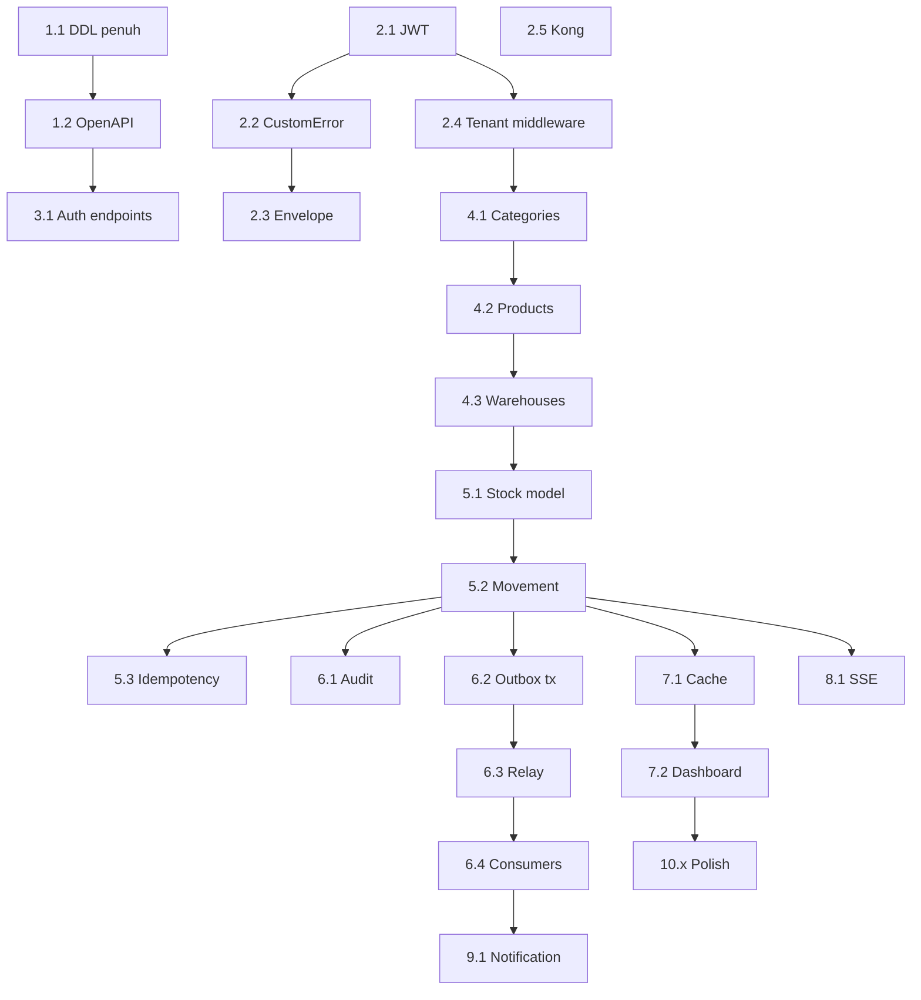

# Backend — Daftar Tugas Refactor & Fitur (hingga selaras ARCHITECTURE.md)

Dokumen ini merinci **semua pekerjaan refactor dan penambahan fitur** yang diperlukan agar backend selaras dengan [ARCHITECTURE.md](ARCHITECTURE.md), dari baseline sekarang hingga backend dianggap **selesai** menurut roadmap §17 (tanpa pekerjaan frontend Next.js kecuali disebut eksplisit sebagai kontrak API saja).

**Cara membaca**

- Setiap tugas punya **ID**, **deskripsi**, **prasyarat**, **langkah-langkah**, **acceptance criteria**, **rujukan**.
- Urutan numerik ID **tidak selalu urutan eksekusi** — ikuti **prasyarat** dan diagram dependensi di bagian akhir.
- Quality gates global: setelah setiap blok besar, jalankan `make test` / `make test-all` sesuai [.claude/rules/general/verification-pipeline.md](.claude/rules/general/verification-pipeline.md).

---

## Konvensi format tugas

Setiap subbagian menggunakan pola berikut:

| Kolom | Isi |
|-------|-----|
| **ID** | Pengenal stabil (mis. `4.1`) |
| **Judul** | Nama singkat |
| **Deskripsi** | Mengapa tugas ini ada; ruang lingkup |
| **Prasyarat** | Tugas atau kondisi yang harus sudah benar |
| **Langkah-langkah** | Urutan teknis sedetail mungkin |
| **Acceptance criteria** | Daftar verifikasi objektif |
| **Rujukan** | § di ARCHITECTURE.md atau file terkait |

---

# Bagian 0 — Baseline & gap singkat (sudah ada vs belum)

| Area | Sudah ada (ringkas) | Belum / parsial |
|------|---------------------|-----------------|
| Monorepo + fx | `services/inventory`, `services/authentication`, `infra/postgres`, `infra/redis`, `pkg/common/logger`, `pkg/database/base`, `transaction` | Facade inventory minim (`PingDB` saja); domain catalog/warehouse/movement masih placeholder |
| HTTP | Echo + `stub.RegisterHandlers` (OpenAPI codegen) | Banyak endpoint §9 belum di OpenAPI & handler |
| Auth | Register tenant+admin, Login, JWT access | Refresh, logout, `/auth/me`; klaim JWT perlu diselaraskan §7 |
| Error HTTP | `pkg/common/errorcodes` + `AppError` + `ToHTTP` | Belum pola `CustomError` berantai seperti docs; respons belum selalu envelope §9 |
| DB | Migrasi/seeding parsial — cek `infra/database` | Skema penuh §8 (DDL) harus konsisten satu per satu |
| Kong | `infra/kong/kong.yml` | Route lengkap, JWT plugin, rate limit §16 |
| Workers / Outbox / SSE | `pkg/eventbus` ada | Outbox relay, worker konsumen, SSE §10–§12 |

---

# Bagian 1 — Fondasi data & kontrak API

## 1.1 Skema database menyeluruh (DDL §8)

**Deskripsi**  
Menyelaraskan PostgreSQL dengan **Entity Relationship** dan **DDL** di ARCHITECTURE §8: `tenants`, `users`, `categories`, `products`, `warehouses`, `stock_balances`, `movements`, `movement_lines`, `audit_logs`, `outbox_events`, enum movement, constraint idempotensi, indeks.

**Prasyarat**  
Backup DB dev; toolchain migrasi (`Makefile` / skrip) sudah bisa dijalankan.

**Langkah-langkah**

1. Inventarisasi file migrasi yang ada di `infra/database/migrations/`.
2. Bandingkan dengan setiap blok DDL di ARCHITECTURE §8 (categories, products, warehouses, stock_balances, movements, movement_lines, audit_logs, outbox_events).
3. Untuk setiap selisih: tambahkan migrasi **up** dan **down** yang reversibel.
4. Pastikan tipe ENUM `movement_type`, `movement_status` konsisten dengan kode Go nanti.
5. Tambahkan constraint unik: `(tenant_id, sku)`, `(tenant_id, reference_number)`, `(tenant_id, idempotency_key)` sesuai dokumen.
6. Jalankan migrasi pada DB kosong; verifikasi `\d+` / query katalog Postgres.
7. Jalankan rollback down lalu up lagi pada salinan CI/dev.
8. Update seed mock di `infra/database/cmd/seed/` agar konsisten kolom baru (tanpa breaking mock lain).
9. Dokumentasikan nomor migrasi terbaru di komentar PR / README internal bila perlu.

**Acceptance criteria**

- [x] Semua tabel §8 ada dengan kolom dan FK yang sama dengan dokumen — tabel domain **0003–0009** selaras DDL §8; gap **tenants/users** ditutup migrasi **`0010_align_tenants_users_architecture.sql`** (`slug`, `is_active`, `settings`; `full_name`, `is_active`, `last_login`; `password_hash` tetap dipakai).
- [ ] Migrasi **up/down** diverifikasi pada Postgres bersih (`make migration-status`, `make up`, `make down`, `make up`) dengan **`DB_DSN`** — wajib dijalankan di lingkungan dev/CI yang punya DB.
- [ ] **Seed dev** tanpa error setelah migrasi (`make seed-mock`) — wajib dijalankan dengan DB yang sudah **`make up`** ke **0010**.
- [x] Tidak ada **`float32`** untuk uang — kolom **`products.price`** DECIMAL; seed **`ProductSeed.Price`** tetap **`float64`**.

**Status implementasi parsial (gap §7 pada tenants/users)**

| Deliverable | Lokasi |
|-------------|--------|
| Migrasi 0010 | [`infra/database/migrations/0010_align_tenants_users_architecture.sql`](infra/database/migrations/0010_align_tenants_users_architecture.sql) |
| Insert/register tenant + admin | [`pkg/database/schemas/authentication.go`](pkg/database/schemas/authentication.go), [`services/authentication/repository/repository.go`](services/authentication/repository/repository.go), [`services/authentication/service/authentication.go`](services/authentication/service/authentication.go) (`generateTenantSlug`) |
| Seed demo | Konstanta **`demoTenantSlug`** + kolom baru di [`infra/database/cmd/seed/service/`](infra/database/cmd/seed/service/) |
| Dependensi | `github.com/google/uuid` langsung di [`go.mod`](go.mod) untuk slug unik |

**Tes otomatis:** `go test ./...` lolos di workspace. Verifikasi goose + seed adalah langkah manual dengan Postgres.

**Rujukan**  
ARCHITECTURE §8.

---

## 1.2 OpenAPI sumber kebenaran untuk dua layanan utama

**Deskripsi**  
Menjadikan `services/inventory/openapi/openapi.yaml` dan `services/authentication/openapi/openapi.yaml` mencakup kontrak mendekati §9 (setidaknya resource yang diprioritaskan tim), dengan operasi request/response yang bisa digenerate ke `stub/`.

**Prasyarat**  
1.1 selesai atau subset tabel yang dipetakan ke API sudah fix.

**Langkah-langkah**

1. Daftar endpoint dari ARCHITECTURE §9 yang masuk **fase pertama** (biasanya Auth + Products + Categories + Warehouses).
2. Tambahkan path, operationId, skema komponen (Product, Category, Warehouse, Error envelope jika dipakai).
3. Selaraskan header: `Authorization`, `X-Request-Id`, dan bila perlu `X-Tenant-Id` / hanya JWT — putuskan satu pola dan dokumentasikan.
4. Jalankan codegen (`oapi-codegen` / target Makefile `openapi-gen` jika ada).
5. Sesuaikan `ServerHandler` / method stub yang baru muncul agar tidak compile error.
6. Tambahkan test kontrak minimal: handler mengembalikan 501/placeholder terpusat sampai usecase siap — atau langsung wire ke usecase jika tugas domain sudah jalan.

**Acceptance criteria**

- [ ] `make` / build seluruh modul lolos setelah codegen.
- [ ] Spesifikasi versi dicatat; breaking change diawali versi atau path `/api/v1`.
- [ ] Daftar endpoint terdokumentasi vs “belum diimplementasi” (tabel tracking di dokumen ini atau board).

**Rujukan**  
ARCHITECTURE §9; [docs/service/how-to-structure-openapi.md](docs/service/how-to-structure-openapi.md).

---

# Bagian 2 — Refactor & kemampuan platform (cross-cutting)

## 2.1 Refactor JWT (alur klaim, access/refresh, validasi)

**Deskripsi**  
Menyatukan **pembuatan**, **pemverifikasian**, dan **middleware Echo** untuk JWT agar konsisten dengan §7 (struktur klaim: `sub`, `tenant_id`, peran/izin jika ada), mendukung **access** vs **refresh**, header `Authorization: Bearer`, dan perilaku error terstandarisasi.

**Prasyarat**  
`pkg/common/jwt` dan layanan authentication sudah bisa issue token saat login; tes yang ada tidak dilanggar.

**Langkah-langkah**

1. **Audit kode**: baca [`pkg/common/jwt/claims.go`](pkg/common/jwt/claims.go), [`pkg/common/jwt/service.go`](pkg/common/jwt/service.go), middleware di `services/authentication/api/jwt_middleware.go`, dan pemakaian di `services/inventory` (jika ada).
2. **Spesifikasi klaim**: pastikan struct `Claims` mencakup minimal `TenantID`, `TokenType` (access|refresh), `RegisteredClaims` (sub, exp, iat).
3. **Issuer / audience**: jika produksi membutuhkan `iss`/`aud`, tambahkan ke klaim dan validasi; dokumentasikan di `.env.example`.
4. **Pemisahan secret** (opsional disarankan): secret access vs refresh disimpan terpisah di config; refresh hanya dipakai di route `/auth/refresh`.
5. **Login**: saat `Login`, terbitkan access token (TTL pendek) + refresh token (TTL panjang) sesuai kebijakan; simpan refresh di DB/redis bila §7 mewajibkan revoke (lihat tugas refresh/logout).
6. **Middleware inventory**: jika inventory memakai Echo terpisah, gunakan middleware yang sama dari `pkg/common/jwt` (hindari duplikasi parse JWT).
7. **Error path**: untuk token invalid/expired/salah tipe — kembalikan kode HTTP dan body melalui `errorcodes.ToHTTP` atau CustomError setelah tugas 2.2.
8. **Kong**: catat bahwa Kong bisa memvalidasi JWT di edge atau meneruskan ke service — dokumentasikan pilihan di `infra/kong/kong.yml` (plugin JWT) dan pastikan tidak dobel validasi yang membingungkan.
9. **Unit test**: perbarui `jwt_middleware_test.go` dan tambahkan kasus: missing token, wrong sig, expired, access vs refresh salah route.

**Acceptance criteria**

- [ ] Access token berisi `tenant_id` dan `sub` yang dipakai usecase untuk scoping.
- [ ] Refresh token tidak diterima di endpoint API biasa (hanya `/auth/refresh`).
- [ ] Semua endpoint terlindungi (sesuai OpenAPI security) gagal dengan 401 yang konsisten bila token invalid.
- [ ] Tes unit/lintas untuk middleware lulus.

**Rujukan**  
ARCHITECTURE §7; kode [`pkg/common/jwt`](pkg/common/jwt).

---

## 2.2 Fitur / migrasi ke CustomError chain

**Deskripsi**  
Mengadopsi pola **`common.NewCustomError` + `WithMessageID` + `WithErrorCode` + `WithHTTPCode`** dari [docs/conventions/codebase-conventions.md](docs/conventions/codebase-conventions.md), atau menyatukan dengan **`AppError`** yang sudah ada di [`pkg/common/errorcodes`](pkg/common/errorcodes) agar **satu** jalan keluar untuk HTTP — tanpa dua sistem paralel tanpa dokumentasi.

**Prasyarat**  
Keputusan tim: **(A)** implement `CustomError` baru di `pkg/common` dan adapter ke `ToHTTP`, atau **(B)** perluas `AppError` dengan `MessageID` + error code enum agar setara dengan konvensi.

**Langkah-langkah**

1. **Desain**: pilih A atau B; tulis 1 paragraf ADR singkat di komentar `pkg/common/errorcodes` atau file `docs/adr/001-errors.md` (opsional).
2. **Implementasi tipe**: jika CustomError —
   - struct dengan method chaining;
   - implement `error`;
   - map ke kode HTTP + body JSON (kode mesin, message, message_id untuk i18n).
3. **ToHTTP**: perbarui `errorcodes.ToHTTP` agar mengenali `CustomError`, `AppError`, dan error native (wrapped).
4. **Migrasi bertahap**: mulai dari `services/authentication` (login, register), lalu `services/inventory/api/errors.go`.
5. **Jangan pecah kontrak**: pastikan response JSON konsisten dengan §9 (success flag + error object) — jika dokumen mensyaratkan envelope `{ success, error: { code, message, details } }`, sesuaikan `ToHTTP`.
6. **Terjemahan**: jika pakai `WithMessageID`, sambungkan ke `pkg/common/translations` bila ada.
7. **Hapus duplikasi**: hindari `fmt.Errorf` langsung di handler untuk error domain; gunakan helper.
8. **Tes**: unit test untuk map error → status + body.

**Acceptance criteria**

- [ ] Tidak ada error domain “mentah” yang lolos ke klien sebagai 500 tanpa klasifikasi.
- [ ] Semua handler terbaru memakai satu pola yang disepakati.
- [ ] Dokumentasi ARCHITECTURE §15 diperbarui jika format body final berubah.

**Rujukan**  
ARCHITECTURE §15; [docs/conventions/codebase-conventions.md](docs/conventions/codebase-conventions.md).

---

## 2.3 Envelope response API (success / error / pagination)

**Deskripsi**  
Menyelaraskan body JSON dengan **Standard Response Format** ARCHITECTURE §9 (`success`, `data`, `meta.request_id`, `meta.pagination`).

**Prasyarat**  
2.2 (agar error envelope konsisten).

**Langkah-langkah**

1. Definisikan struct response generik di `pkg/common/httpresponse` atau sejenis (nama bebas, satu paket).
2. Helper: `OK(c, data)`, `OKList(c, data, pagination)`, `Fail(c, err)`.
3. Ubah handler/stub yang di-generate — jika codegen tidak mendukung wrapper, bungkus di `ServerHandler` method atau gunakan middleware response (hati-hati dengan streaming/SSE).
4. Pastikan `request_id` dari Echo middleware ikut di `meta`.
5. Update OpenAPI untuk skema response wrapper (atau dokumentasikan wrapper di luar schema generator).

**Acceptance criteria**

- [ ] Respons sukses dan gagal mengikuti bentuk §9.
- [ ] Pagination untuk list endpoint punya `total`, `page`, `per_page`, `total_pages` sesuai kontrak.

**Rujukan**  
ARCHITECTURE §9.

---

## 2.4 Middleware tenant & otorisasi

**Deskripsi**  
Memastikan **`tenant_id`** dari JWT masuk ke `context.Context` (bukan hanya `echo.Context`) untuk usecase/repository, dan dasar **RBAC** (role/permission) sesuai §7 jika diperlukan.

**Prasyarat**  
2.1 selesai.

**Langkah-langkah**

1. Tambahkan helper `TenantIDFromContext(ctx)` di `pkg/common/jwt` atau `pkg/common/contextx`.
2. Middleware: setelah JWT valid, parse klaim dan simpan di context dengan tipe yang aman (private key context).
3. Di **repository** scoped: selalu filter `WHERE tenant_id = ?` dari context (kecuali metode admin eksplisit — dokumen §6).
4. Tambahkan pemeriksaan permission sederhana di usecase (atau middleware) untuk aksi sensitif (mis. `movement:confirm`).
5. Tulis tes: request tanpa tenant di context → error terklasifikasi.

**Acceptance criteria**

- [ ] Tidak ada query domain yang lupa filter `tenant_id` untuk data multi-tenant.
- [ ] Klien tidak bisa mengisi `tenant_id` di body untuk mengganti tenant — sumber kebenaran hanya JWT.

**Rujukan**  
ARCHITECTURE §6–§7.

---

## 2.5 Kong: routing, JWT, rate limit, CORS

**Deskripsi**  
Melengkapi [`infra/kong/kong.yml`](infra/kong/kong.yml) agar sesuai §3.1 dan §16: upstream `inventory-api`, `authentication-service` / path auth, `notification-service`, plugin yang diperlukan.

**Prasyarat**  
Layanan berjalan di compose dev; port konsisten dengan Dockerfile.

**Langkah-langkah**

1. Definisikan **services** Kong untuk setiap upstream (host:port dari docker-compose).
2. **Routes**: `/api/v1/inventory`, `/api/v1/auth` (atau sesuai keputusan pemisahan auth), `/api/v1/notifications`.
3. Pasang plugin **JWT** atau **OIDC** jika validasi di gateway diinginkan — selaraskan dengan 2.1 agar tidak double-sign.
4. Pasang **rate-limiting** pada login/register.
5. **CORS** untuk origin frontend dev/prod.
6. **`request-id`** / correlation header ke upstream.
7. Dokumentasi cara dapat token dan test dengan `curl` di README backend.

**Acceptance criteria**

- [ ] Semua path publik §9 yang sudah diimplementasi dapat diuji melalui Kong (bukan langsung port layanan).
- [ ] Rate limit terbukti dengan burst test manual (403/429 sesuai plugin).

**Rujukan**  
ARCHITECTURE §3.1, §9, §16.

---

# Bagian 3 — Layanan Authentication (lengkap §9 Auth)

## 3.1 Endpoint `/auth/refresh`, `/auth/logout`, `/auth/me`

**Deskripsi**  
Melengkapi API auth sesuai tabel §9 yang belum ada.

**Prasyarat**  
2.1, 2.2, 2.3; skema DB jika perlu tabel refresh token / session.

**Langkah-langkah**

1. Rancang penyimpanan refresh token (DB table atau Redis) — konsisten dengan keputusan §7.
2. Implement `/auth/refresh`: validasi refresh token, rotasi token opsional, keluarkan pasangan baru.
3. Implement `/auth/logout`: revoke refresh/session.
4. Implement `/auth/me`: baca profil dari `sub` + join user DB.
5. Tambahkan di OpenAPI + codegen + handler.
6. Tes integrasi dengan Kong.

**Acceptance criteria**

- [ ] Semua baris tabel Auth §9 berperilaku sesuai definisi produk.

**Rujukan**  
ARCHITECTURE §9 (Auth).

---

# Bagian 4 — Domain Inventory: Catalog & Warehouse

## 4.1 Repository & usecase Categories

**Deskripsi**  
CRUD kategori dengan soft delete dan aturan §8 (cek produk aktif sebelum hapus).

**Langkah-langkah**

1. Schema/migrasi final untuk `categories`.
2. Repository di `domains/catalog/repository`: List, Get, Create, Update, SoftDelete dengan filter tenant.
3. Usecase: implement rules soft-delete dari ARCHITECTURE §8.
4. Handler/stub: wire ke usecase.
5. Unit + integration test.

**Acceptance criteria**

- [ ] Semua endpoint Categories §9 untuk fase ini berfungsi dengan tes.

**Rujukan**  
ARCHITECTURE §8–§9.

---

## 4.2 Repository & usecase Products

**Deskripsi**  
CRUD produk, SKU unik per tenant, soft delete dengan aturan **tidak boleh** jika masih ada stok > 0.

**Langkah-langkah**

1. Repository dengan pagination/filter (`search`, `category_id`, sort).
2. Usecase: validasi SKU, reorder_level, metadata JSON.
3. Implement restore soft-deleted jika §9 mensyaratkan POST restore.
4. Tes kasus: hapus ditolak jika stok > 0.

**Acceptance criteria**

- [ ] Rules §8 “Product soft-delete” terpenuhi.

**Rujukan**  
ARCHITECTURE §8–§9.

---

## 4.3 Repository & usecase Warehouses

**Deskripsi**  
CRUD gudang + soft delete dengan aturan stok §8.

**Langkah-langkah**

1. Mirror pola catalog; tambahkan kode unik per tenant.
2. Validasi soft-delete warehouse §8.

**Acceptance criteria**

- [ ] Endpoint Warehouses §9 berfungsi; penghapusan ditolak jika ada stok.

**Rujukan**  
ARCHITECTURE §8–§9.

---

# Bagian 5 — Stock & Movement (inti konsistensi)

## 5.1 Model saldo & locking

**Deskripsi**  
Memastikan `stock_balances` konsisten dengan movement (transaksi DB).

**Langkah-langkah**

1. Repository stock: get/update dengan **transaction**.
2. Pertimbangkan locking baris (`FOR UPDATE`) untuk race outbound/transfer.
3. Tes konkuren sederhana (parallel goroutine atau integration).

**Acceptance criteria**

- [ ] Tidak ada saldo negatif untuk constraint §8.
- [ ] Transfer tidak “hilang” saat konkuren (uji minimal).

**Rujukan**  
ARCHITECTURE §1 prinsip Stock Consistency.

---

## 5.2 Movement: inbound, outbound, transfer, adjustment

**Deskripsi**  
Implement §9 movements + §8 CHECK constraint gudang sesuai `movement_type`.

**Langkah-langkah**

1. Usecase per jenis movement; validasi warehouse sesuai CHECK di DDL.
2. Draft → confirm → cancel dengan status enum.
3. Movement lines dalam satu tx dengan update stock + audit + outbox (lihat 6.2).

**Acceptance criteria**

- [ ] Semua skenario movement §9 dengan tes.

**Rujukan**  
ARCHITECTURE §8–§9.

---

## 5.3 Idempotency-Key

**Deskripsi**  
Header `Idempotency-Key` untuk POST movement (dan resource create lain jika §9 mensyaratkan).

**Langkah-langkah**

1. Tabel atau kolom penyimpanan kunci idempotensi per tenant + hash request (desain singkat).
2. Middleware atau usecase: jika kunci sama dan request sama → kembalikan respons sebelumnya; jika bentrok → 409.

**Acceptance criteria**

- [ ] Duplikasi accidental tidak menggandakan movement.

**Rujukan**  
ARCHITECTURE §9 header.

---

# Bagian 6 — Audit log & Outbox & Event

## 6.1 Audit log untuk setiap mutasi

**Deskripsi**  
Insert `audit_logs` pada create/update/delete sesuai §14.

**Langkah-langkah**

1. Helper di usecase atau decorator tx untuk menulis audit dengan before/after (JSON).
2. Endpoint GET `/audit-logs` §9 dengan filter.

**Acceptance criteria**

- [ ] Mutasi baris pada entitas utama meninggalkan jejak audit.

**Rujukan**  
ARCHITECTURE §8, §14, §9.

---

## 6.2 Outbox dalam transaksi movement

**Deskripsi**  
Pada commit movement terkonfirmasi, insert **outbox_events** dengan `published=false` (§10).

**Langkah-langkah**

1. Pastikan insert outbox dalam **tx sama** dengan movement/stock.
2. Definisikan payload JSON per `event_type` §10.

**Acceptance criteria**

- [ ] Tidak ada event outbox tanpa commit DB movement.

**Rujukan**  
ARCHITECTURE §10.

---

## 6.3 Outbox relay → Redis Streams

**Deskripsi**  
Worker/job polling `outbox_events`, `XADD` ke stream `inventory.events`, update `published=true`.

**Langkah-langkah**

1. Implement di `workers/` (pakai `pkg/eventbus`).
2. Retry + backoff; deadlock dengan relay paralel — gunakan pemrosesan batch ber-ID atau lock advisory.

**Acceptance criteria**

- [ ] Setelah movement, pesan muncul di Redis Stream.

**Rujukan**  
ARCHITECTURE §10.

---

## 6.4 Consumer groups: alerts, reports, sync

**Deskripsi**  
Consumer sesuai §10 (alerts, reports, sync, realtime bridge).

**Langkah-langkah**

1. Daftarkan consumer group pada stream.
2. Implement minimal: **AlertWorker** untuk `StockBelowThreshold`.
3. DLQ §12 retry policy.

**Acceptance criteria**

- [ ] Minimal satu event mengalir sampai worker menjalankan efek samping (log/email stub).

**Rujukan**  
ARCHITECTURE §10–§12.

---

# Bagian 7 — Cache & Dashboard API

## 7.1 Cache-aside §13

**Deskripsi**  
TTL dan invalidasi untuk product list, category tree, warehouse list, dashboard summary.

**Langkah-langkah**

1. Pakai Redis dari `infra/redis`; pola key dari §13.
2. Invalidate pada write path di usecase.
3. Stock balance **tidak di-cache** sesuuh dokumen.

**Acceptance criteria**

- [ ] Tidak ada data basi setelah update (uji manual atau integration).

**Rujukan**  
ARCHITECTURE §13.

---

## 7.2 Endpoint dashboard `/dashboard/summary`, `/dashboard/movements/chart`

**Deskripsi**  
Agregasi sesuai §9.

**Langkah-langkah**

1. Query teroptimasi + indeks; untuk summary bisa materialized view di masa depan — versi pertama query langsung + cache pendek TTL.

**Acceptance criteria**

- [ ] Respons sesuai kontrak dan performa wajar pada seed besar.

**Rujukan**  
ARCHITECTURE §9, §13.

---

# Bagian 8 — Realtime SSE

## 8.1 SSE `/sse/stock` + Redis Pub/Sub

**Deskripsi**  
§11: usecase publish ke channel `stock:{tenant_id}`; Echo handler SSE subscribe dan push ke klien.

**Langkah-langkah**

1. Implement SSE di `services/inventory/api` dengan auth JWT (query atau cookie — putuskan aman).
2. Hubungkan publish pada event stok berubah (setelah commit atau dari consumer — dokumentasikan urutan).

**Acceptance criteria**

- [ ] Klien uji (`curl` atau halaman tes) menerima event saat stok berubah.

**Rujukan**  
ARCHITECTURE §11.

---

# Bagian 9 — Notification service & integrasi

## 9.1 Notification service konsumen event

**Deskripsi**  
`services/notification` mengonsumsi stream atau endpoint internal untuk kirim email/webhook §3.1.

**Langkah-langkah**

1. Wire notification ke Redis / HTTP internal.
2. Template notifikasi per tenant (opsional).

**Acceptance criteria**

- [ ] Event alert menghasilkan percobaan kirim (stub SMTP atau log).

**Rujukan**  
ARCHITECTURE §3.1, §12.

---

# Bagian 10 — Polish produksi

## 10.1 Health, metrics, tracing

**Deskripsi**  
Health per layanan; Prometheus; OpenTelemetry §17 Phase 5.

**Langkah-langkah**

1. `/healthz`, `/readyz` dengan cek DB/Redis.
2. Metrics HTTP dasar.
3. Trace ID propagate dari Kong.

**Acceptance criteria**

- [ ] Compose/stack dapat mengecek kesehatan untuk orkestrasi.

**Rujukan**  
ARCHITECTURE §17.

---

## 10.2 CI/CD & image per `cmd`

**Deskripsi**  
Build Docker terpisah `inventory-api`, `authentication`, `workers`, `notification` §17.

**Acceptance criteria**

- [ ] Pipeline hijau; artefak dapat di-deploy.

---

## 10.3 Load test & tuning indeks

**Deskripsi**  
Indeks untuk query movement list, audit, stock sesuai pola akses §8.

---

# Dependensi tingkat tinggi (urutan eksekusi disarankan)

---

# Lampiran — Checklist akhir “backend selesai” menurut ARCHITECTURE.md

Gunakan sebagai verifikasi akhir sebelum menyatakan backend complete (frontend bisa terpisah).

- [ ] Skema §8 lengkap + seed konsisten.
- [ ] API §9 yang diprioritaskan tim: implementasi + OpenAPI + tes.
- [ ] JWT + tenant scoping + error & envelope konsisten.
- [ ] Movement + stock **atomik**; idempotensi movement create.
- [ ] Audit + outbox + relay + minimal consumer berjalan.
- [ ] Cache §13 dengan invalidasi benar; stock tidak di-cache.
- [ ] SSE atau pengganti yang disepakati untuk realtime §11.
- [ ] Kong §16 untuk routing production-like.
- [ ] Observability & CI §17 Phase 5.

---

*File ini boleh dipecah menjadi tiket tracking (GitHub Issues / Jira) dengan menyalin ID tugas.*
